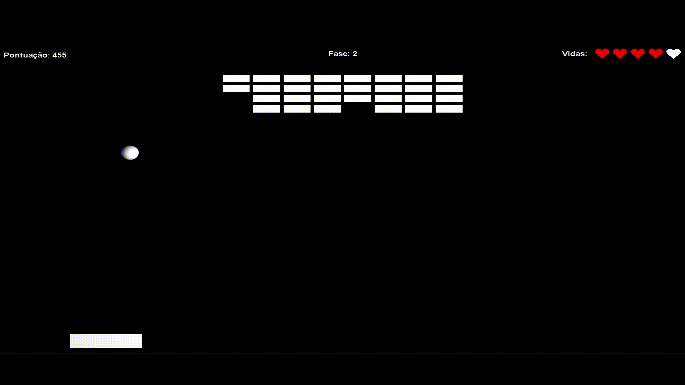

# Breakout Java

<p align="center">
    
</p>

Implementação do jogo Breakout desenvolvido com a biblioteca JOGL (Interface da OpenGL para Java).

## Requisitos
Para executar o jogo é necessário instalar:
- Java 17. Possível instalar pela [Oracle](https://www.oracle.com/java/technologies/downloads/#java17).

## Como baixar
A versão mais recente do JAR pode ser baixado na página de [Releases](https://github.com/HenriBDev/breakout-java/releases).

- [Baixe a última versão do jogo](https://github.com/HenriBDev/breakout-java/releases/latest/download/breakout-java.jar)

## Executando o arquivo JAR
- Tenha certeza que o Java está instalado
- Você pode executar clicando duas vezes no JAR ou executar o seguinte comando no diretório que estiver baixado o JAR:
```bash
java -jar breakout-java.jar
```
## Executando em modo debug
- O jogo possui uma tela de debug para teste de funcionalidades novas, para acessar este modo basta executar adicionando o parâmetro -Ddebug=true
```bash
java -jar -Ddebug=true breakout-java.jar
```
